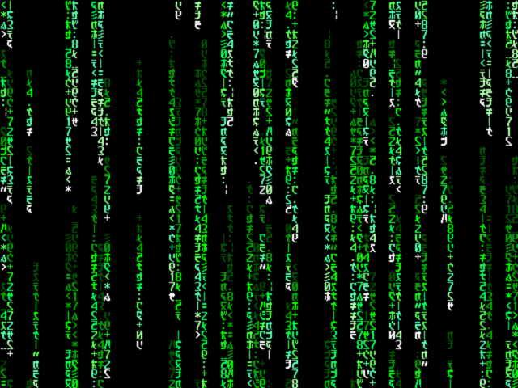

## How it Works

This is a standalone VGA demo that runs with or without input, replicating *The
Matrix* Digital Rain effect.

Upon circuit reset, the glyphs will appear to fall from the top of the screen.
Additionally, some glyphs will intermittently change.

You can change the palette with the three pins, `ui_io[2:0]`.

**NOTE** The default VGA timing requires a pixel clock of 25.175 MHz. If you
want to drive higher resolutions, the base clock rate must be adjusted
accordingly with the Display Clocks table below. You must also set the two
pins `ui_io[7:6]` to select your preferred mode.

## How to Test

Plug into a VGA monitor and select this circuit to test. By default, the
circuit must be clocked at (or very near) to **25.175 MHz**. There are four VGA
timing modes, representing four different display resolutions, which must be
both specifically clocked *and* have the pins `ui_io[7:6]` set according to the
following table.

### Display Clocks

**Pins 6 and 7 must be paired with pixel clock**

| `ui_io[7:6]` | Clock (Hz) | VGA Timing Mode             |
|-------------:|-----------:|----------------------------:|
|  (default) 0 |   25175000 |  640 x  480 @ 60 fps ( VGA) |
|            1 |   40000000 |  800 x  600 @ 60 fps (SVGA) |
|            2 |   74250000 | 1280 x  720 @ 60 fps (  HD) |
|            3 |   74250000 | 1920 x 1080 @ 30 fps ( FHD) |
 
### Palette Input

Use **Pins 0, 1, and 2** `ui_io[2:0]` for palette selection:

| `ui_io[2:0]` | Palette    | Example |
|-------------:|:-----------|---------|
|  (default) 0 | Green      |
########
|
|            1 | Red        |
########
|
|            2 | Blue       |
########
|
|            3 | Grape Soda |
########
|
|            4 | Hellfire   |
########
|
|            5 | Monochrome |
########
|
|            6 | Noir       |
########
|
|            7 | Rainbow    |
########
|

## External hardware

Requires the [TinyVGA PMOD](https://github.com/mole99/tiny-vga)
